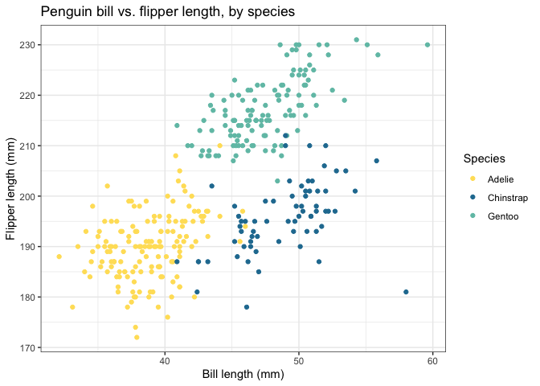

# coolors

Need a quick color palette for a plot or map in R?

<!-- **<span style="color: #f3c98b;">c</span><span style="color: #7a93ac;">o</span><span style="color: #3f6634;">l</span><span style="color: #dc9e82;">o</span><span style="color: #c16e70;">r</span>** -->

<!-- 462255 -->

<!-- f25f5c -->

<!-- ddb967 -->

<!-- 247ba0 -->

<!-- 70c1b3 -->

I use [coolors.co](https://coolors.co) multiple times a day to find
color palettes. It’s well-built, easy-to-use, and produces beautiful
palettes. Still, it’s sometimes easier to integrate palette-building
within my R workflow, rather than copying and pasting from a web
browser; thus, this package was born.

<!-- With how often I was visiting the site and exporting hex codes, I finally got around to writing this package mirroring some of the site's functionality.  -->

So, why use `coolors`?

  - Contains \~2,000 beautiful five-color base palettes, sourced from
    [coolors.co](https://coolors.co)
  - Allows flexible palette randomization and customization based on
    your needs
  - Stores your palette history, so you can mix, match, and compare
    palettes until you find one you like\!

## Installation

You can install the development version of this package from GitHub.

``` r
# install.packages("devtools")
devtools::install_github("simmwill/coolors")
```

## Basic usage

There are three functions that make this package useful:

  - `palette_coolors()` generates a color palette (choosing a random
    base palette by default)
  - `coolors_history()` recalls the current session’s history of
    generated palettes
  - `shuffle_pal()` allows you to change specific colors in a generated
    palette

Let’s test them out\! First, we’ll generate some random color palettes
using repeated calls to `palette_coolors()`.

``` r
library(coolors)

# generate a few random coolors palettes
palette_coolors()
```

<!-- -->

``` r
palette_coolors()
```

<!-- -->

``` r
palette_coolors()
```

<!-- -->

## Features

### Palette history

Since I usually call `palette_coolors()` several times until I find the
palette I like, it’s often helpful to look back on the palettes I’ve
called. We can do that using `coolors_history()`. (History is not
preserved between sessions.)

Here, we can see the three palettes above listed in our history by their
palette IDs:

``` r
# see history, with most recent at top of list
coolors_history()
#> [[1]]
#> Most recent:  
#>           336 
#> 
#> [[2]]
#> [1] 346
#> 
#> [[3]]
#> [1] 450
```

We can specify a palette by its ID using the `palette_num` argument.
We’ll call palette 450, which was in our history above.

``` r
palette_coolors(palette_num = 450)
```

<!-- -->

### Shorter/longer palettes

We can also use `palette_coolors(n = #)` to generate a palette shorter
or longer than the default five. If shorter than five, the palette will
simply be truncated; if longer, colors will be interpolated.

We’ll use palette 336 as an example:

``` r
# 100-color palette (nearly a gradient)
palette_coolors(palette_num = 336, n = 100)
```

<!-- -->

``` r
# 2-color palette (chooses the first two colors)
palette_coolors(palette_num = 336, n = 2)
```

<!-- -->

### Hex codes

Finally, if we just want the hex codes for a palette, we can use `hex =
TRUE`.

``` r
# generate hex codes for palette 336
palette_coolors(palette_num = 336, hex = TRUE)
#> Coolors palette 336
#> [1] "#4f6d7a" "#c0d6df" "#dbe9ee" "#4a6fa5" "#166088"
```

### Custom randomization with `shuffle_pal()`

Let’s say we find a palette that we really love…except for one of the
colors. Wouldn’t it be nice to randomize that one color while the others
remain the same? We can do this using the `shuffle_pal()` function\!

We’ll use palette 336 from above as an example:

``` r
# original palette
palette_coolors(palette_num = 336)
```

<!-- -->

I like this palette, but it’d be nice to replace the third color with
another color. To do this, I’ll first call the base palette, 336. Then,
I’ll pipe the result to `shuffle_pal()`, using the `freeze` argument to
keep the colors that I like.

``` r
library(magrittr)

palette_coolors(palette_num = 336) %>% 
  shuffle_pal(freeze = c(1:2, 4:5))           # I want to keep colors 1, 2, 4, 5
#> Positions shuffled: 3
```

<!-- -->

Also note that you can specify any number of colors to freeze from
`1:1-n`, where `n` is the length of the palette. Here, I call a 7-color
palette and shuffle colors 1, 6, and 7 by `freeze`-ing colors 2 to 5:

``` r
# original palette
palette_coolors(palette_num = 123, n = 7)
```

<!-- -->

``` r
# shuffled palette
palette_coolors(palette_num = 123, n = 7) %>% 
  shuffle_pal(freeze = c(2:5))
#> Positions shuffled: 1, 6, 7
```

<!-- -->

### Iterative randomization

Finally, a more complex use-case that’s surprisingly common the more I
use this package. Let’s say *from the already-shuffled palette above*, I
now only want to change the first color.

What if I just change the second line of code to `shuffle_pal(freeze =
c(2:7))` and rerun it? Unfortunately, this will leave me frustrated.
Colors 6 and 7 will be randomized from a different seed than the initial
call, and they’ll be changed in addition to color 1.

<!-- # ```{r, fig.height=1} -->

<!-- # palette_coolors(palette_num = 123, n = 7) %>%  -->

<!-- #   shuffle_pal(freeze = c(2:7)) -->

<!-- # ``` -->

Instead, we can modify different positions of an already-modified
palette in one of two ways: use base R’s automatically-created
`.Last.value` object to modify the last palette, or pipe the hex codes
of an already-modified palette directly into `shuffle_pal()`.

``` r
.Last.value %>% 
  shuffle_pal(freeze = c(2:7))
#> Positions shuffled: 1
```

<!-- -->

``` r
c("#ef626c", "#BB5A57", "#F68A5F", "#FFE066", "#6D9C8C", "#48b8d0", "#9eb3c2") %>% 
  shuffle_pal(freeze = c(2:7))
#> Positions shuffled: 1
```

<!-- -->

We can then keep running either of these chunks of code until we find
the right color for position 1.

## Using your palette\!

So, once we’ve found a palette we like, how can we use it? Perhaps the
most straightforward way is to assign the character vector of hex codes
produced using `palette_coolors(hex = TRUE)` to an R object.

Here, we pull hex codes from palette 123 and assign this palette to an
object we name `pal`. We can then use this palette in various R
functions, e.g. `ggplot2` functions that allow specification using hex
codes such as `scale_color_manual()`.

``` r
library(ggplot2)
library(palmerpenguins)

pal <- palette_coolors(palette_num = 123, hex = TRUE)[3:5]

ggplot(penguins, aes(x = bill_length_mm, y = flipper_length_mm, color = species)) + 
  geom_point() + 
  scale_color_manual("Species", values = pal) +
  theme_bw() +
  labs(x = "Bill length (mm)",
       y = "Flipper length (mm)",
       title = "Penguin bill vs. flipper length, by species"
  )
```

<!-- -->

## Notes

All color palettes courtesy of [coolors.co](https://coolors.co) and its
creator, [Fabrizio Bianchi](http://fabrizio.io/). This package also
draws inspiration from several wonderful color palette packages,
including [`wesanderson`](https://github.com/karthik/wesanderson).
